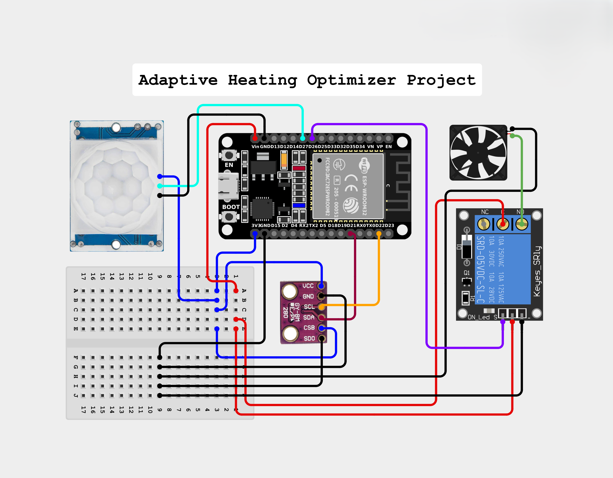

# EcoHeat Edge: Adaptive Heating Optimizer

**An intelligent, localized IoT heating control system prioritizing energy efficiency and comfort.**

## Project Overview

**EcoHeat Edge** creates an intelligent heating system that learns a room's occupation habits (using a **PIR sensor**) and current temperature. All decisions are made locally by a **Raspberry Pi 3** (the "Edge Brain"), ensuring privacy and reliability. The Pi sends commands to an **ESP32** (the "Controller"), which then activates a relay to control a fan (simulating a heater). The entire system can be monitored and controlled in real-time via a **custom Android application**.

## Core Features
*   **Adaptive Logic:** The system only turns on the heater if the room is occupied AND the temperature is below a set target.
*   **Smart Habit Tracking:** Learns usage patterns to optimize heating schedules.
*   **IoT Edge Processing:** Logic runs locally on the Raspberry Pi for low latency and independence from the cloud.
*   **Mobile Dashboard:** A custom Android app connects to the system to display live data (temperature, presence) and send manual commands.
*   **Wireless Communication:** The ESP32, Raspberry Pi, and Android App communicate wirelessly over the local Wi-Fi network using the **MQTT** protocol.

## Hardware Components
*   **Edge Brain:** Raspberry Pi 3 Model B (or similar)
*   **Controller:** ESP32-DevKitC
*   **Temperature Source:** Open-Meteo API (Originally **BMP280**, replaced due to sensor failure)
*   **Presence Sensor:** HC-SR-501 PIR Sensor
*   **The Switch:** 1-Channel 5V Relay Module
*   **Heater (Test Load):** 5V DC Fan
*   **Accessories:**
    *   MicroSD Card (for Raspberry Pi OS)
    *   Power Supplies (5V Micro-USB)
    *   Breadboard & Jumper Wires

## Wiring Diagram

Here is the complete hardware wiring for the controller components.



## Software & Setup

### Configuration

Before running the code, you must configure the network and location settings.

1.  **ESP32 Configuration:**
    *   Create a file named `config.h` inside the `esp32_controller/` directory.
    *   Add your Wi-Fi SSID/password and the IP address of your MQTT Broker (Raspberry Pi).
    *   **Example `esp32_controller/config.h`:**
        ```c
        #define WIFI_SSID "YOUR_WIFI_SSID"
        #define WIFI_PASSWORD "YOUR_WIFI_PASSWORD"
        #define MQTT_BROKER_IP "192.168.1.100" // Your Pi's IP
        ```

2.  **Raspberry Pi Configuration:**
    *   Create a file named `config.py` inside the `raspberrypi_logic/` directory. A template is available in `raspberrypi_logic/config_example.py`.
    *   **Example `raspberrypi_logic/config.py`:**
        ```python
        MQTT_BROKER_IP = "192.168.1.100"
        LATITUDE = 48.8566  # Your Latitude
        LONGITUDE = 2.3522  # Your Longitude
        ```

### 1. ESP32 (Controller)
*   **Code:** `esp32_controller/esp32_controller.ino`
*   **Environment:** Arduino IDE
*   **Dependencies:** `PubSubClient`, `WiFi.h`

### 2. Raspberry Pi (Edge Brain)
*   **Code:** `raspberrypi_logic/raspberrypi_logic.py`
*   **Environment:** Raspberry Pi OS
*   **Broker:** `Mosquitto` (MQTT Broker)
*   **Dependencies:** `paho-mqtt` (Python), `requests`
*   **Simulation/Testing:** Check `raspberrypi_logic/simulation/` for testing scripts (`generate_fake_history.py`) and mock data.

### 3. Android App (Dashboard)
*   **Code:** `My-Application/`
*   **Environment:** Android Studio
*   **Language:** Kotlin
*   **Dependencies:** `paho-mqtt` (Android), `core-splashscreen`

## How It Works (Data Flow)

1.  **SENSE:** The **ESP32** detects motion via the PIR sensor. Weather data is fetched via API on the Pi.
2.  **PUBLISH:** The **ESP32** sends presence data to the MQTT broker.
3.  **MONITOR:** The **Android App** listens to topics and updates the UI in real-time.
4.  **DECIDE:** The **Python script** on the **Raspberry Pi** processes data against user habits and target temperature.
5.  **COMMAND:** The **Raspberry Pi** publishes an "ON" or "OFF" command.
6.  **ACT:** The **ESP32** receives the command and activates the **Relay**.

---

### Context
*This project was originally developed as a prototype entry for the ROMITEF 2026 university competition ("Optimiseur de Chauffage Adaptatif").*
